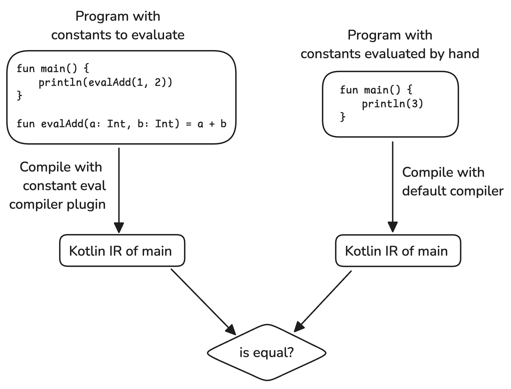

# Constant evaluation Kotlin compiler plugin

A compiler plugin that evaluates some constants (also known as constant folding).

## Description

All functions with the `eval` prefix are evaluated (if possible).

```Kotlin
fun main() {
    // evalAdd(1, 2) must be evaluated as 3
    println(evalAdd(1, 2))
}

fun evalAdd(a: Int, b: Int): Int {
    return a + b
}
```

Inside an eval function the following statements and expressions are allowed:

- Operations on primitives. Basically methods declared inside classes Int, Boolean and String. It ignores Byte, Short,
  Long, Float and Double to simplify things. To avoid repeating, let’s call these types constant types.
- If/when expressions
- While loops
- Create val/var variables and set values for them.
- The "eval" function must return a result of a constant type.
- The "eval" function can accept only arguments of a constant type.
- If the "eval" function cannot be computed at runtime, it is left as is.

### Bonus features

- Inside "eval" functions calls to other eval functions including itself (recursion) are allowed
- For recursion to work the arguments to an "eval" function, can no longer be restricted to just constants but any
  expression that the evaluator can calculate.

## Build and run all tests

To build the plugin run:

```bash
./gradlew build
```

## Testing Strategy

Testing constant evaluation can be tricky, because if it is correctly implemented there shouldn't be any different
behavior from an optimized and unoptimized program. Therefore, just running the program twice, once compiled with the
optimization and once without only tells us if the IR rewrite is faulty but not if it ran at all.

Instead, I decided on every testcase containing two programs, once with some constants to evaluate and once where I
evaluated them by hand. The first program will be compiled with my plugin enabled while the second uses the default
compiler. Since the plugin should produce the same IR as the program which I evaluated by hand I can simply compare the
IR Dump of both programs.



With this strategy we not only know that it the constant evaluation ran but also that it produced what we expected. We
therefore don't even need to execute the compiled programs. The only drawback is that if the comparison isn't
successfully, reading the output of large programs can be difficult.
